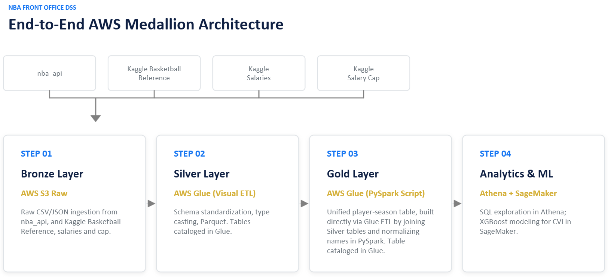

# NBA Front Office Contract Analytics
NBA player contract value analysis using AWS cloud analytics and machine learning.

## Project Overview
This project develops an end-to-end cloud analytics pipeline to evaluate NBA player contract value. The goal is to estimate player salary (as a percentage of salary cap) based on their on-court performance to identify players whose actual salaries differ from their model-predicted value.
The project uses AWS to ingest, clean, integrate, analyze, and model data from multiple NBA-related sources such as nba_api and Basketball Reference. Data moves through a medallion architecture in Amazon S3, with AWS Glue used for ETL and Amazon Athena used for querying and data validation. Finally, Amazon SageMaker is used for machine learning and player valuation.

## Business Question
NBA teams operate under salary cap constraints, making efficient allocation of cap space an important component of roster construction. The central question of this project is:

**Which NBA players appear to be overvalued or undervalued relative to their most recent on-court performance?**

By comparing actual player salaries with salaries predicted from performance data, the analysis provides a framework for identifying potentially valuable contracts, inefficient contracts, and possible trade targets.

## Architecture
The project was implemented as an end-to-end analytics pipeline on AWS using a medallion architecture. 

-**Bronze Layer:** Raw source data was stored in Amazon S3.

-**Silver Layer:** AWS Glue ETL jobs cleaned the source datasets, selecting rows to use, casting data types as desired, and converting to Parquet.

-**Gold Layer:** The cleaned datasets were joined and transformed into a modeling-ready player-season dataset. Only player-seasons with at least 500 minutes were counted.

-**Amazon Athena:** SQL queries were used to validate the processed data, investigate data quality, and test joins across sources. 

-**Amazon SageMaker:** The final gold dataset was used for machine learning analysis and player contract valuation. An XGBoost model was applied to the dataset to determine a model-implied salary for each player-season.

The overall data flow was:

**Source Data -> Amazon S3 Bronze -> AWS Glue -> Amazon S3 Silver -> AWS Glue -> Amazon S3 Gold -> Amazon Athena / Amazon SageMaker -> Amazon S3 Gold (final scored table)**



## Data Sources
This project uses four different data sources, all located in the 'data/' directory.

**bask_ref_advanced.csv:** This data comes from Basketball Reference and contains player performance data that includes advanced metrics such as Win Shares, Value Over Replacement Player, and Player Efficiency Rating.

**player_stats_basic.csv:** This data was pulled directly from nba_api using Python and contains basic player data such as age and height as well as statistics such as points per game, rebounds per game, and assists per game.

**player_salaries.csv:** This data came from Kaggle and contains player salary information for each season between 2015-16 and 2025-26.

**cap_tax_aprons.csv:** This data came from Kaggle and contains league salary cap information, allowing us to determine the salary cap used by the NBA each season.

## Repository Structure

```text
nba-front-office-analytics/
├── data/                   # Source datasets and final scored output
├── docs/
│   ├── screenshots/        # AWS implementation screenshots
│   └── architecture.png    # AWS architecture diagram
├── notebooks/              # SageMaker machine learning notebook
├── sql/                    # Athena SQL queries and data validation
├── src/
│   └── glue/               # AWS Glue ETL jobs
└── README.md               # Project documentation
```

### Key Files

- `src/glue/` contains the five AWS Glue jobs used to transform the source data and construct the Gold modeling dataset.
- `sql/` contains the Athena SQL used for table creation, data-quality validation, and cross-source join testing.
- `notebooks/` contains the SageMaker notebook used for machine learning and player valuation.
- `data/` contains the source datasets used by the pipeline and the final `player_value_scored.parquet` output.
- `docs/architecture.png` contains the project architecture diagram.
- `docs/screenshots/` contains screenshots documenting the AWS implementation and successful pipeline execution.

## Cross-Source Joins and Name Normalization
The four data sources used did not share a common Player ID field, and a player's name sometimes varied slightly across sources, e.g., Ish Smith versus Ishmael Smith. The silver datasets were joined based on a normalized name field plus the corresponding season. The Glue job for creating the gold table standardized names by converting them to lowercase, removing punctuation, removing generational suffixes, and removing accents. It also made use of a small alias-mapping layer for players who still, after those normalization techniques were applied, had slightly different names across sources. In the end, we were not able to salvage every last player-season from the first source - nba_api - but we got everything we could. A handful of players each season did not have corresponding salary data in our salary table. In the future, additional time could be spent hunting these exceptions down one-by-one for completeness, but it is unlikely to meaningfully impact the model or conclusions given the small proportion left unused.

## Modeling Approach
The model predicts each player's salary as a percentage of the NBA salary cap. Using salary as a share of the cap rather than nominal dollars allows for more meaningful comparisons across seasons. The analysis compared several approaches, including OLS regression, but ultimately settled on using XGBoost because it provided the strongest validation performance. Many of the modeled relationships are likely non-linear, hence XGBoost outperforming OLS. A random forest was also tried, but XGBoost still achieved higher performance.

Model performance was evaluated using R^2, RMSE, and MAE.

All models were trained on 2015-16 through 2022-23 seasons and validated on 2023-24 season data. Finally, the XGBoost model was tested on 2024-25 data before being retrained and used to produce results for the 2025-26 season data.

## Results, Interpretations, and Limitations
The final model produced an R^2 of .756 for the 2025-26 season. `notebooks/nba_contract_value_model_sagemaker.ipynb` shows additional results, including some exploration of the players found to have the highest disparity between actual and model-implied salary for the 2025-26 season. Note that a positive value_gap indicates the player's model-implied salary is higher than their actual salary, and vice versa.

Because a player's salary for a given season is determined prior to seeing his performance in that season, users should be careful to not misinterpret these results. This model can only identify contracts that may be over or under valued in retrospect; it cannot say whether it may have been a good or bad idea to offer the contract at the time. Additionally, this model does not take into account the length of the contract or the presence of any future player or team options. Even a "bad" contract can be valuable if it expires after the season, and even a salary that looks mediocre at worst can be a significantly negative asset if the duration is long enough. Furthermore, this model has all the limitations that its underlying components do. To the extent that advanced metrics and basic statistics cannot fully capture the value of certain activities - defense, drawing charges, setting good screens - it may systematically undervalue those when determining the model-implied salary. As a result, certain players who are valuable in large part for their defense may be identified here as overpaid even if that is not a fair assessment in reality. Finally, many quirks and nuances of the salary cap create situations where players may genuinely be more valuable to certain teams than others. For example, teams over the soft cap but below the hard cap may be more incentivized to spend money to retain current players for which they have Bird Rights, as the alternative may be to simply lose that player for nothing and be otherwise unable to spend the same amount of money to acquire a new player. This adds further complexity to interpretation, but the model can still be used as a rough starting point when determining which players may be overvalued or undervalued.

## Setup and Reproduction
To reproduce the complete cloud pipeline, you need an AWS environment with access to S3, Glue, Athena, and SageMaker.

### General Workflow

1. Upload the source datasets to the appropriate locations in the S3 Bronze layer.
2. Run the four source-specific AWS Glue jobs to clean and standardize the raw datasets and write the results to the S3 Silver layer.
3. Run the Gold-table Glue job to join the Silver datasets, apply data-quality (name normalization) rules, and create the modeling-ready Gold dataset.
4. Use the SQL queries in `sql/` with Amazon Athena to create/query tables and perform data-quality and join validation.
5. Run the notebook in `notebooks/` to train and evaluate the salary-prediction models and generate player contract-value estimates.
6. The final scored player dataset can be exported as `player_value_scored.parquet`.

## Technologies Used

- **Amazon S3** — cloud storage and Bronze-Silver-Gold data lake
- **AWS Glue / PySpark** — ETL and data transformation
- **Amazon Athena / SQL** — querying and data validation
- **Amazon SageMaker** — machine learning environment
- **Python / pandas** — data analysis and modeling
- **scikit-learn** — regression and ensemble modeling
- **XGBoost** — final gradient-boosted salary prediction model
- **Parquet** — processed and final analytical data storage

## Authors
-Nick Zurawski

-Efraín Alejandro Gonzalez Gomez

-Sunseong Kwon

Purdue University | MGMT59900 - Big Data Analytics in the Cloud
